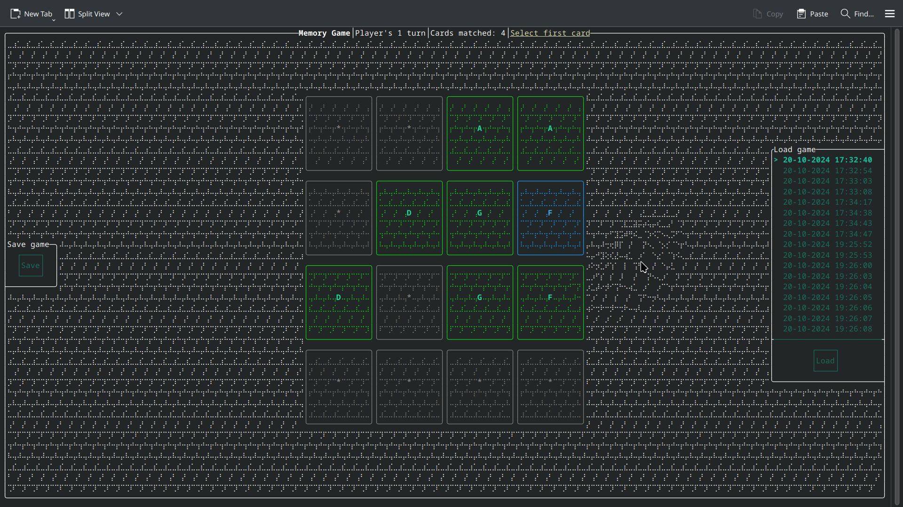

## Simple, cross platform, terminal memory game

# Build
Tested on Linux and Windows, but MacOS, and really any other OS with a CMake port and C++20 compatible compiler, should work as well.

* Linux (and other Unix systems like MacOS):
    * Install CMake and Git (different commands based on your distribution)
    * `git clone https://github.com/mikolajlubiak/memory`
    * `cd memory`
    * `mkdir build`
    * `cd build`
    * `cmake ..`
    * `cmake --build .`
    * `./memory`
* Windows:
    * `winget install Git.Git`
    * `winget install Kitware.CMake`
    * `git clone https://github.com/mikolajlubiak/memory`
    * `cd memory`
    * `mkdir build`
    * `cd build`
    * `cmake ..`
    * `cmake --build .`
    * `.\memory`
* Windows (Visual Studio):
    * `winget install Git.Git`
    * `winget install Kitware.CMake`
    * Open Visual Studio and click "Clone a repository"
    * Under "Repository location" type/paste: https://github.com/mikolajlubiak/memory
    * Click "Clone"
    * Wait for the project to setup, press F5, or run the project from UI

# Gameplay
* First, select your preferred options.
* Move around using arrow keys.
* Select a card using enter.
* Players take turns; if your selected cards don't match, it's the next player's turn.
* At the end, the player with the most matched cards wins.
* If you want, you can save the current game state and load it later.

# Contribution
For the purposes of this project, I added functionality to the library I use.
I wanted the memory board grid to update in real time as the slider value changes.
There was no way to do that, so I quickly studied the library's source code and added that feature myself.
I achieved this by making the slider call a callback function each time the slider value change.
I've made a pull request to the upstream, original library, and its author told me it looks like a good thing to have.
Pull request: https://github.com/ArthurSonzogni/FTXUI/pull/938

