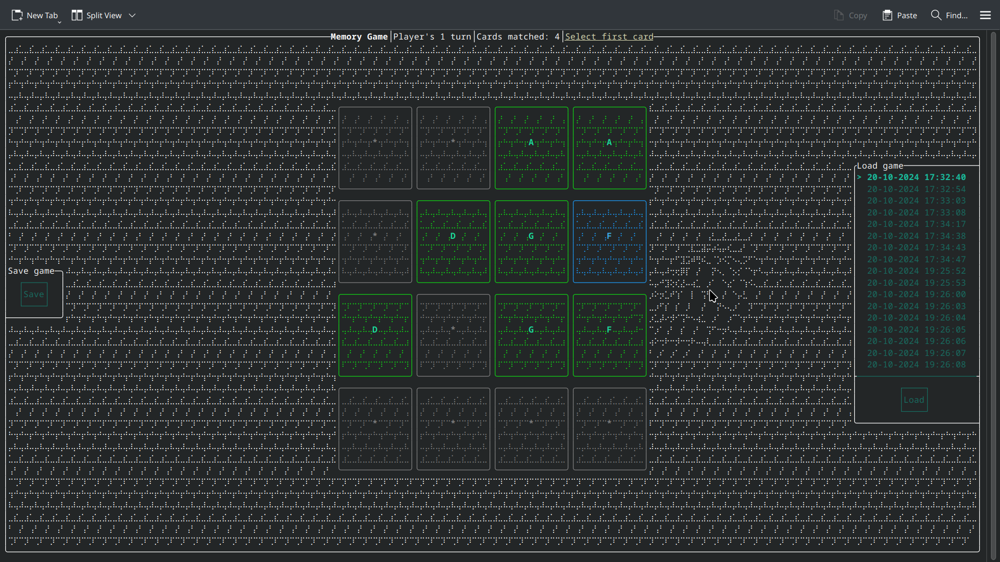

## Simple, cross platform, terminal memory game
#### Project development and progress showcase: https://video.infosec.exchange/w/p/fxme6he9a3h8AAHQHrrMG4

# Build
Tested on Linux and Windows, but MacOS, and really any other OS with a CMake port and C++20 compatible compiler, should work as well.

* Linux (and other Unix systems like MacOS):
    * Install CMake and Git (different commands based on your distribution)
        * Fedora: `sudo dnf install cmake git`
        * Arch: `sudo pacman -S --needed cmake git`
    * `git clone https://github.com/mikolajlubiak/memory`
    * `cd memory`
    * `mkdir build`
    * `cd build`
    * `cmake ..`
    * `cmake --build .`
    * `./memory`
* Windows (Terminal):
    * `winget install Git.Git`
    * `winget install Kitware.CMake`
    * `git clone https://github.com/mikolajlubiak/memory`
    * `cd memory`
    * `mkdir build`
    * `cd build`
    * `cmake ..`
    * `cmake --build .`
    * `.\memory`
* Windows (Visual Studio):
    * `winget install Git.Git`
    * `winget install Kitware.CMake`
    * Open Visual Studio and click "Clone a repository"
    * Under "Repository location" type/paste: https://github.com/mikolajlubiak/memory
    * Click "Clone" and select the folder inside UI
    * Wait for the project to setup, press F5, or run the project from UI

# Gameplay
* First, select your preferred options.
* Move around using arrow keys.
* Select a card using enter.
* Players take turns; if your selected cards don't match, it's the next player's turn.
* At the end, the player with the most matched cards wins.
* If you want, you can save the current game state and load it later.

> [!NOTE]
> # Contribution
> Added a callback to the FTXUI slider so the memory-board grid updates in real time.
> Upstream PR merged: https://github.com/ArthurSonzogni/FTXUI/pull/938.
> Contributions (issues or PRs) welcome.
